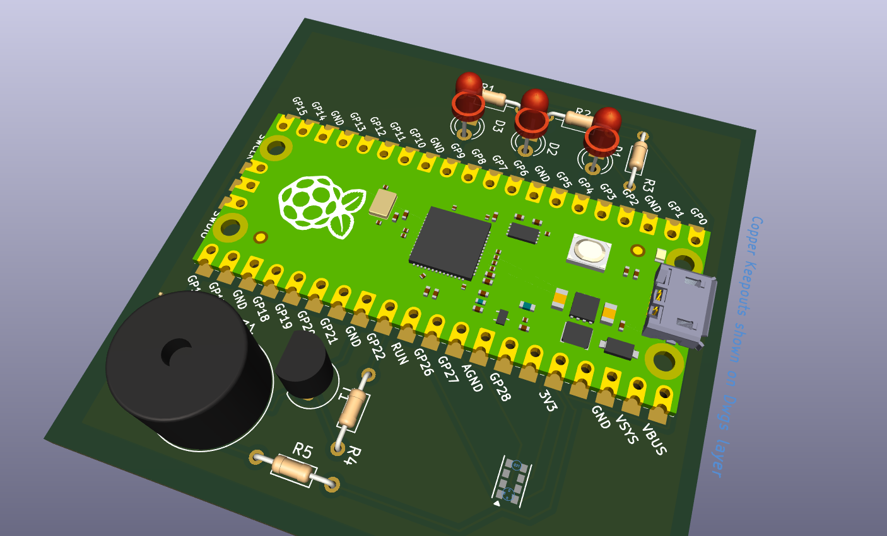

# Fabricação PCB de identificado de cores

## Introdução
O projeto desse repositório é uma prototipação para a fabricação de uma PCB para identificação de cores com um sensor de proximidade e RGB e três leds para reprodução das cores, além de um buzzer para alertas. Essa placa também possui um conector para o microcontrolador Raspberry Pico W, que será o responsável por controlar o sistema. O projeto foi desenvolvido no KiCad e os arquivos gerber estão disponíveis para download.

## Estrutura de arquivos

Para encontrar os seguintes arquivos, basta acessar a pasta src ou clicar nos link abaixo:

#### Projeto completo: [ponderada_sem_6.kicad_pro](https://github.com/LuizaRubim/m5-activities/blob/main/ponderada_s6/src/ponderada_sem_6.kicad_pro)
 
Esse arquivo dá acesso completo aoa arquivos do projeto e pode ser aberto no KiCad, cao tenha instalado na sua máquina.

#### Desenho esquemático: [ponderada_sem_6.kicad_sch](https://github.com/LuizaRubim/m5-activities/blob/main/ponderada_s6/src/ponderada_sem_6.kicad_sch)
 
Esse arquivo contém o desenho esquemático e é a partir dele que se pode ter uma visão de quais componentes estão presentes na placa, além de poder ver as especificações de cada componente.

#### PCB: [ponderada_sem_6.kicad_pcb](https://github.com/LuizaRubim/m5-activities/blob/main/ponderada_s6/src/ponderada_sem_6.kicad_pcb)

Esse arquivo contém o desenho da placa de circuito impresso e é a partir dele que se pode ter uma visão de como os componentes estão dispostos na placa, as ligações que serão impressas e o tamanho da placa.

#### Gerber: [arquivos gerber](https://github.com/LuizaRubim/m5-activities/blob/main/ponderada_s6/src/arquivos_gerbers)

Essa pasta contém os arquivos gerber, que são os arquivos que serão enviados para a fábrica de PCBs para que a placa seja impressa.